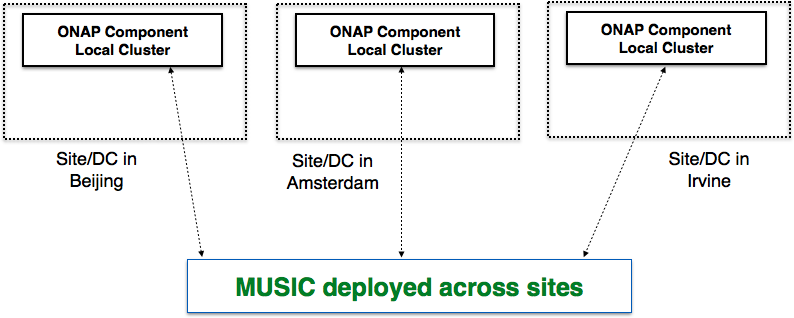

.. This work is licensed under a Creative Commons Attribution 4.0 International License.
.. http://creativecommons.org/licenses/by/4.0

Architecture
============

Project Description
-------------------

To achieve 5 9s of availability on 3 9s or lower software and infrastructure in a cost-effective manner, ONAP components need to work in a reliable, active-active manner across multiple sites (platform-maturity resiliency level 3). A fundamental aspect of this is  state management across geo-distributed sites in a reliable, scalable, highly available and efficient manner. This is an important and challenging problem because of three fundamental reasons:

- Current solutions for state-management of  ONAP components like MariaDB clustering, that work very effectively within a site, may not scale across geo-distributed sites (e.g., Beijing, Amsterdam and Irvine) or allow partitioned operation (thereby compromising availability). This is mainly because WAN latencies are much higher across sites and frequent network partitions can occur.

- ONAP components often have a diverse range of requirements in terms of state replication. While some components need to synchronously manage state across replicas, others may tolerate asynchronous replication. This diversity needs to be leveraged to provide better performance and higher availability across sites.

- ONAP components often need to partition state across different replicas, perform consistent operations on them and ensure that on failover, the new owner has access to the latest state. The distributed protocols to achieve such consistent ownership is complex and replete with corners cases, especially in the face of network partitions. Currently, each component is building its own handcrafted solution which is  wasteful and worse, can be erroneous.

In this project, we identify common state management concerns across ONAP components and provide a multi-site state coordination/management service (MUSIC) with a rich suite of recipes that each ONAP component can simply configure and use for their state-management needs.

Functionality
-------------

At its core, MUSIC provides a scalable sharded eventually-consistent data-store (Cassandra) wherein the access to the keys can be protected using a locking service (built on Zookeeper) that is tightly coupled with the data-store. ONAP components can use the MUSIC API directly to store and access their state across geo-distributed sites.  This API enables ONAP components to achieve fine-grained flexible consistency on their state.

MUSIC also provides a rich set of recipes (mdbc, prom, musicCAS, musicQ) that ONAP components can use to build multi-site active-active/active-passive/federated state-management solutions: 

- mdbc: The most crucial recipe is a multi-site database cache (mdbc) that enable ONAP components that maintain state in a SQL database to avail the benefits of MUSIC without compromising their need to use transactional SQL DBs. These ONAP components can rely on existing db clustering techniques like MariaDB for transactionality and complex querying within a site. mdbc will intercept each of these read/write calls to the db cluster and mirror this state to other geo-distributed sites through MUSIC either synchronously or asynchronously (configurable at a table-level).  For example, components like the ONAP Service Orchestrator that use MariaDB to maintain state can directly use this recipe with no change to their SQL code.

- prom:  MUSIC provides a recipe for policy-driven ownership management (prom) of state for ONAP components to (1) partition state across replicas during both initial placement and during failures based on their individual policies (2) ensure correct transfer of state ownership across replicas during site failures and network partitions (3) ensure that the new owner has access to the most recent version of state (if needed).

- musicCAS: The distributed compare and set is a powerful primitive that will allow ONAP components to update shared state in  an atomic manner. This is currently being used by the ONAP HAS (homing service) that is structured a job scheduler with multiple workers trying to pick up client-submitted  jobs, while ensuring that only one of them actually performs the job.

- musicQ: Implementing a geo-distributed queue is a hard problem with many performance implications when data belonging to a queue is sharded across nodes. MUSIC provides a queue API that carefully structures the data to ensure good performance. ONAP HAS (mentioned above) uses this as its job queue. 

Scope
-----
MUSIC is a shared service with recipes that individual ONAP components and micro-service can use for state replication, consistency management and state ownership across geo-distributed sites. MUSIC will make sure that the right service data is available at the right place, and at the right time to enable federated active-active operation of ONAP. For example, we envisage the use of MUSIC for multi-site state management in SO (to store Camunda state across sites), <SDN-C, AppC> (to store ODL related state across sites) , A&AI (to store its graph data) and most other ONAP components that need to manage state across sites. 

Out of Scope
------------
While MUSIC is an optional solution for state-management of ONAP components across sites,  OOM will continue to manage component level and platform level deployment, scalability, redundancy, resiliency, self-healing and high availability on top of Kubernetes across sites for ONAP. 

Usage
-----
MUSIC and its recipes export a REST API apart from mdbc which is implemented as a jdbc driver to enable seamless integration with SQL-based ONAP components. 

Architecture
------------
The figures below how MUSIC can be used in a general context and also provide a specific example of its potential usage in ONAP SO.

